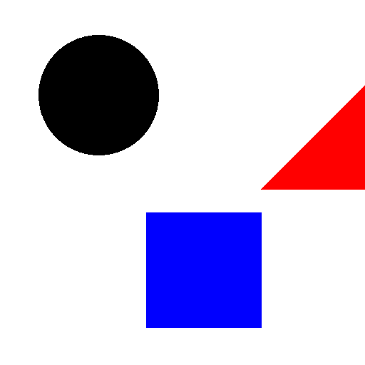

# Lab06: formas geométricas usando numpy

Criar uma imagem com 512 x 512, com fundo branco.
Nesta imagem, posicionar três elementos na imagem: um circulo, um quadrado e um triângulo. As formas devem estar preenchidas com uma cor, a escolha de vocês.

A imagem final, deve estar parecida com a imagem abaixo:

